# 🎯 TRÁFEGO + PROSPECÇÃO: ENCHENDO O FUNIL
## *Estratégia Completa Alinhada ao Método "Venda Sem Esforço"*

---

## 📌 ÍNDICE RÁPIDO

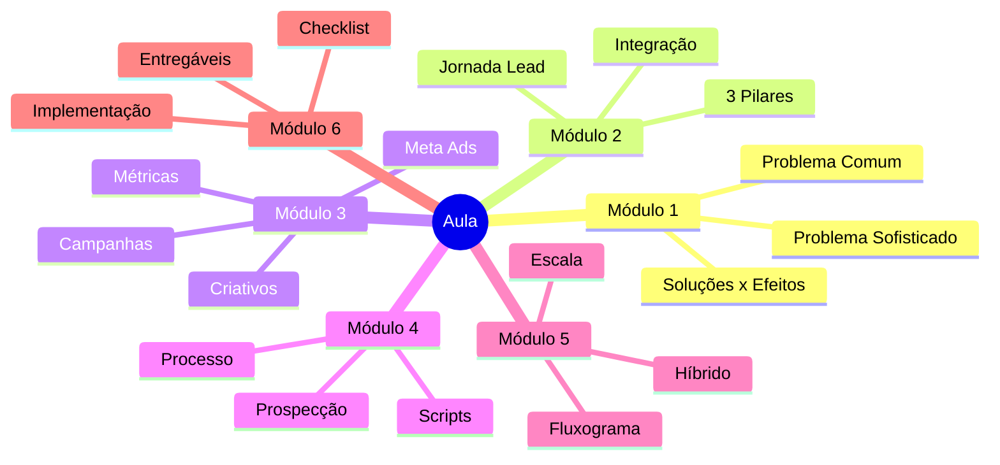

---

# 🔥 HOOK INICIAL (POLARIZAÇÃO)

> ## "Se você precisa fazer 100 reuniões por mês para vender, o problema NÃO é falta de leads."
> ## "O problema é que você está atraindo os leads ERRADOS."

---

## 🎁 PROMESSA DA AULA

Ao final desta aula, você saberá como **encher seu funil com leads que já chegam sabendo:**

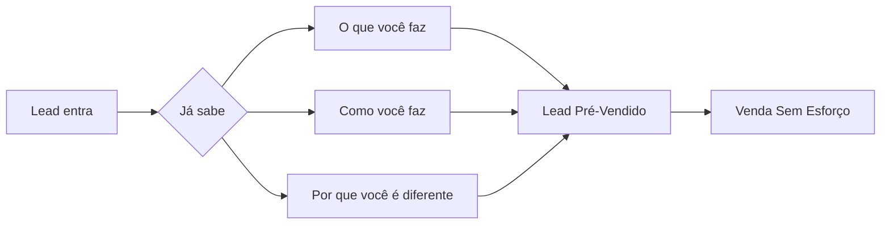

### ✅ Para que você venda SEM:
- ❌ Sessões estratégicas intermináveis
- ❌ Apresentações de 40 slides
- ❌ Follow-ups desesperados
- ❌ Convencimento forçado

---

# 📊 MÓDULO 1: O PROBLEMA COM "ENCHER O FUNIL"
> ⏱️ Duração: 15 minutos

---

## 1.1 - SOLUÇÕES COMUNS vs EFEITOS COLATERAIS

### 📋 Tabela Comparativa: A Realidade do Mercado

| Solução Comum de Mercado | Promessa | Efeito Colateral Real | Impacto no Negócio |
|--------------------------|----------|----------------------|---------------------|
| **Anúncios genéricos** ("Clique aqui", "Saiba mais") | Leads baratos e rápidos | 90% dos leads não sabem quem você é | R$ desperdiçado sem conversão |
| **Prospecção em massa** sem critério | Encher o funil rapidamente | 95% de rejeição, vácuos, perda de tempo | Desgaste emocional + tempo perdido |
| **Lead magnets fracos** (eBook de 5 páginas) | "Lista de e-mails" | Leads frios, nunca respondem | Lista grande mas morta |
| **Investir alto em tráfego** sem estratégia | "Escalar vendas" | Custo por lead alto, ROI negativo | Prejuízo financeiro |

### ⚠️ OS 4 EFEITOS COLATERAIS MORTAIS

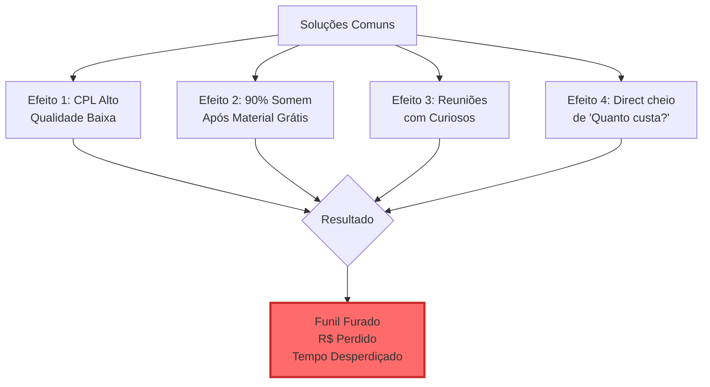

### 💡 EXEMPLO REAL (Case Negativo)

**Pedro, Coach de Vendas:**
- Budget: R$300/dia em anúncios
- Resultado: 150 leads/semana
- **MAS:**
  - CPL: R$14
  - Taxa de conversão para reunião: 8% (12 reuniões)
  - Taxa de conversão reunião → venda: 16% (2 vendas)
  - **Custo de aquisição por cliente: R$1.050**
  - **Ticket médio: R$997**
  - **PREJUÍZO: -R$106 por venda**

> **"Ele não tinha problema de FALTA de leads. Tinha problema de QUALIDADE de leads."**

---

## 1.2 - O PROBLEMA SOFISTICADO

### 🎯 Quem é o ALUNO IDEAL desta aula?

```mermaid
journey
    title Jornada do Aluno Até Aqui
    section Fase 1: Tentativas
      Rodou anúncios genéricos: 3: Eu
      Gastou R$ sem retorno: 1: Eu
      Ficou frustrado: 1: Eu
    section Fase 2: Prospecção
      Tentou prospectar em massa: 2: Eu
      Levou vácuos e rejeições: 1: Eu
      Taxa de conversão baixa: 1: Eu
    section Fase 3: Consciência
      Percebeu: problema não é volume: 4: Eu
      Quer leads QUALIFICADOS: 5: Eu
      Encontrou esta aula: 5: Eu
```

### ✅ CHECKLIST: Você é o aluno ideal se...

- [ ] Já tentou rodar anúncios e gastou dinheiro sem retorno proporcional
- [ ] Já faz prospecção ativa mas a taxa de conversão é baixa (<20%)
- [ ] Tem leads, mas eles não são QUALIFICADOS
- [ ] Quer encher o funil SEM ter que "convencer" depois
- [ ] Está cansado de reuniões improdutivas
- [ ] Busca um sistema que funcione COM MENOS ESFORÇO

### 🔥 AFIRMAÇÃO PROVOCATIVA CENTRAL

> ## "Você não precisa de MAIS leads."
> ## "Você precisa de leads que já chegam PRÉ-VENDIDOS."

---

### 📊 Comparação: Lead Comum vs Lead Qualificado

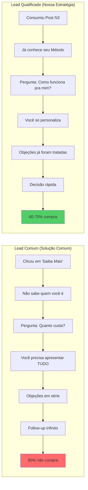

---

# ⚡ MÓDULO 2: FUNDAMENTOS DA ESTRATÉGIA INTEGRADA
> ⏱️ Duração: 20 minutos

---

## 2.1 - OS 3 PILARES DO FUNIL QUALIFICADO

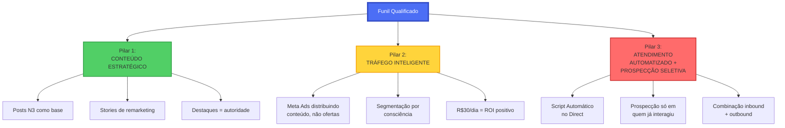

---

### 🏗️ PILAR 1: CONTEÚDO ESTRATÉGICO

#### 📌 Por que conteúdo PRIMEIRO, anúncios DEPOIS?

**Fluxo Errado (Solução Comum):**
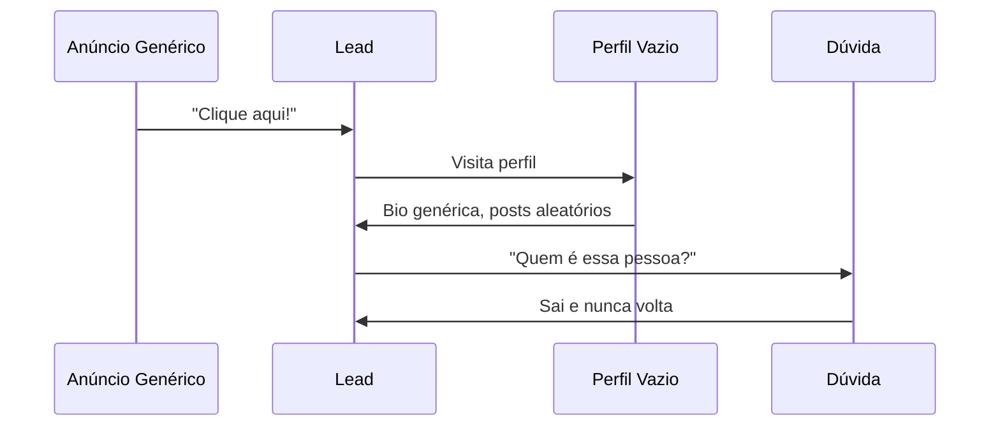

**Fluxo Correto (Nossa Estratégia):**
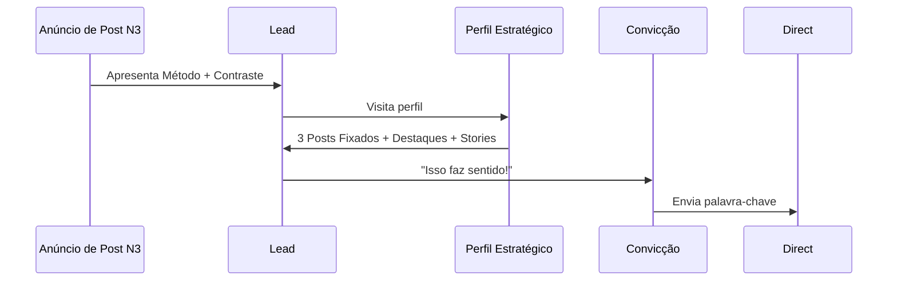

#### 📋 Checklist do Conteúdo Base (Antes de rodar anúncios)

- [ ] **Posts N3 Fixados:**
  - [ ] 1/3 - Explicativo (O que é o Método)
  - [ ] 2/3 - Transformação (Como fica a vida depois)
  - [ ] 3/3 - Contraste (Por que é melhor que Soluções Comuns) ← **Este vai pro anúncio**

- [ ] **Bio Otimizada:**
  - [ ] Nome do Método visível
  - [ ] Promessa clara
  - [ ] CTA (palavra-chave ou link)

- [ ] **Destaques:**
  - [ ] "Comece Aqui" - Explicação do método
  - [ ] "Resultados" - Provas sociais
  - [ ] "Depoimentos" - Cases de sucesso

---

### 💰 PILAR 2: TRÁFEGO INTELIGENTE

#### 🧠 Mindset Anti-Comum

| ❌ Não faremos | ✅ Faremos |
|----------------|-----------|
| Anúncios de conversão direta | Anúncios que EDUCAM primeiro |
| "Compre agora!" | "Entenda por que isso é melhor" |
| Segmentação ampla sem critério | Segmentação por nível de consciência |
| Investir alto esperando milagre | R$30/dia com ROI mensurável |
| Lead magnet fraco | Post N3 como isca (conteúdo valioso) |

#### 📊 Níveis de Consciência do Mercado (Eugene Schwartz)

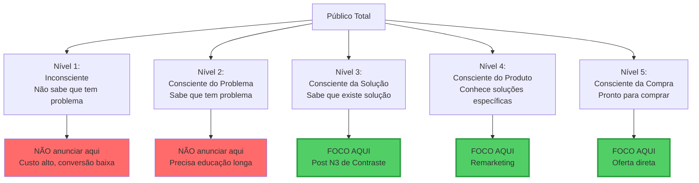

**Nossa estratégia foca em Níveis 3, 4 e 5:**
- **Nível 3:** Pessoas que já tentaram Soluções Comuns (conscientes da solução)
- **Nível 4:** Pessoas que conhecem concorrentes/ferramentas do nicho
- **Nível 5:** Pessoas que já interagiram com seu conteúdo

**Por isso R$30/dia funciona:** Não estamos tentando educar do zero.

---

### 🤖 PILAR 3: ATENDIMENTO AUTOMATIZADO + PROSPECÇÃO SELETIVA

#### 🔀 Canais de Entrada de Leads

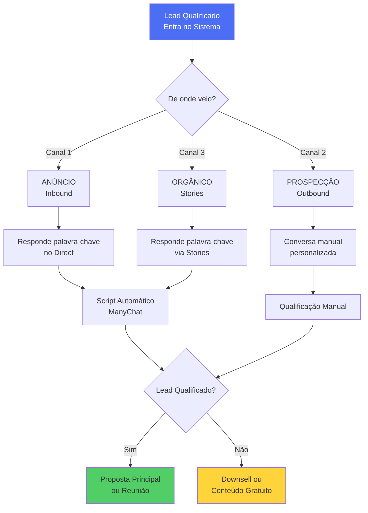

#### ⚙️ Automação vs Manual: Quando usar cada um?

| Situação | Usar Automação | Usar Manual |
|----------|----------------|-------------|
| Lead veio de anúncio e enviou palavra-chave | ✅ Script Automático | ❌ |
| Lead salvou post mas não seguiu | ❌ | ✅ Prospecção personalizada |
| Lead segue há 7+ dias, consome conteúdo, mas não interage | ❌ | ✅ Prospecção seletiva |
| Lead respondeu palavra-chave via Stories | ✅ Script Automático | ❌ |
| Lead de alta intenção (CEO, ticket alto) | ❌ | ✅ Atendimento VIP |
| Lead de remarketing (já conhece o método) | ✅ Script Automático | ❌ |

**Princípio:**
> *"Automatize o OPERACIONAL. Personalize o ESTRATÉGICO."*

---

## 2.2 - A JORNADA DO LEAD QUALIFICADO (DETALHADA)

### 🗺️ Mapa Completo da Jornada

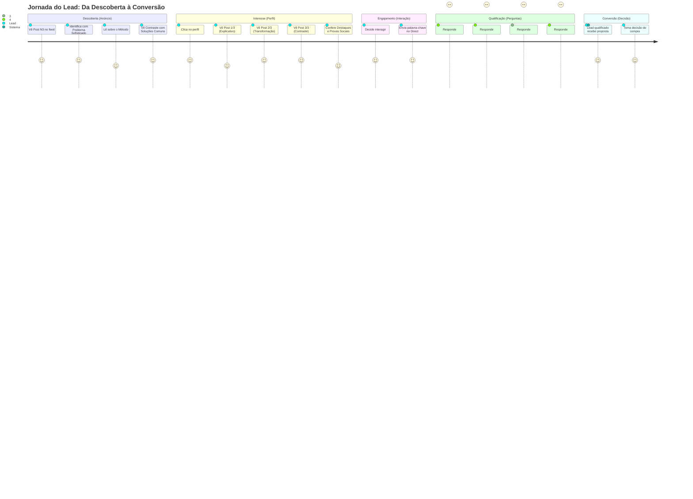

---

### 📍 ETAPA 1: DESCOBERTA (Anúncio de Post N3)

**O que o lead vê no anúncio:**

```
┌─────────────────────────────────────────┐
│  [Imagem do Post N3 - Card 1]           │
│                                         │
│  "Se você ainda faz [Solução Comum],   │
│   está perdendo tempo e dinheiro."     │
│                                         │
│  Para [Público Alvo] que já tentaram   │
│  [Soluções Comuns] e ainda enfrentam   │
│  [Efeito Colateral].                   │
│                                         │
│  Existe uma forma mais simples.        │
│                                         │
│  👉 Leia o post completo               │
│                                         │
│  [Ver Mais]  [❤️ Curtir]  [💬 Comentar] │
└─────────────────────────────────────────┘
```

**Gatilhos ativados:**
- ✅ **Polarização** - Contradiz crença comum
- ✅ **Identificação** - Reconhece o Problema Sofisticado
- ✅ **Curiosidade** - "Existe uma forma mais simples"
- ✅ **Autoridade Implícita** - Está anunciando = investe nisso

---

### 📍 ETAPA 2: INTERESSE (Visita o Perfil)

**O que o lead encontra:**

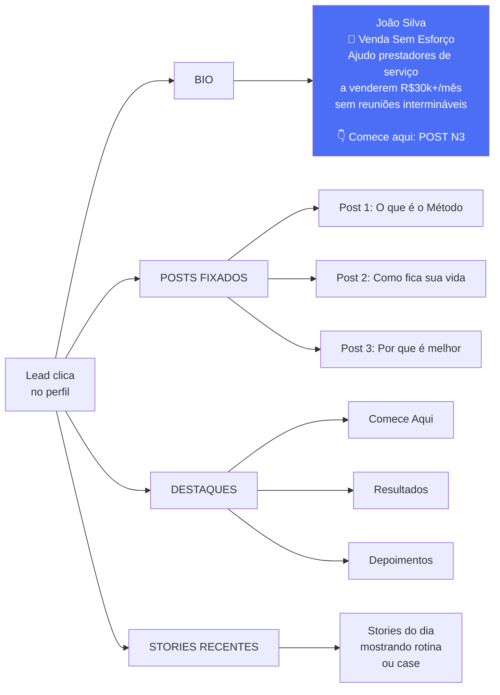

**Congruência total:**
- Anúncio fala de "Venda Sem Esforço" → Bio confirma
- Anúncio mostra Contraste → Posts Fixados aprofundam
- Anúncio promete R$30k+/mês → Destaques provam

> **"Lead pensa: 'Isso faz sentido. Essa pessoa é consistente.'"**

---

### 📍 ETAPA 3: ENGAJAMENTO (Interage)

**3 Caminhos Possíveis:**

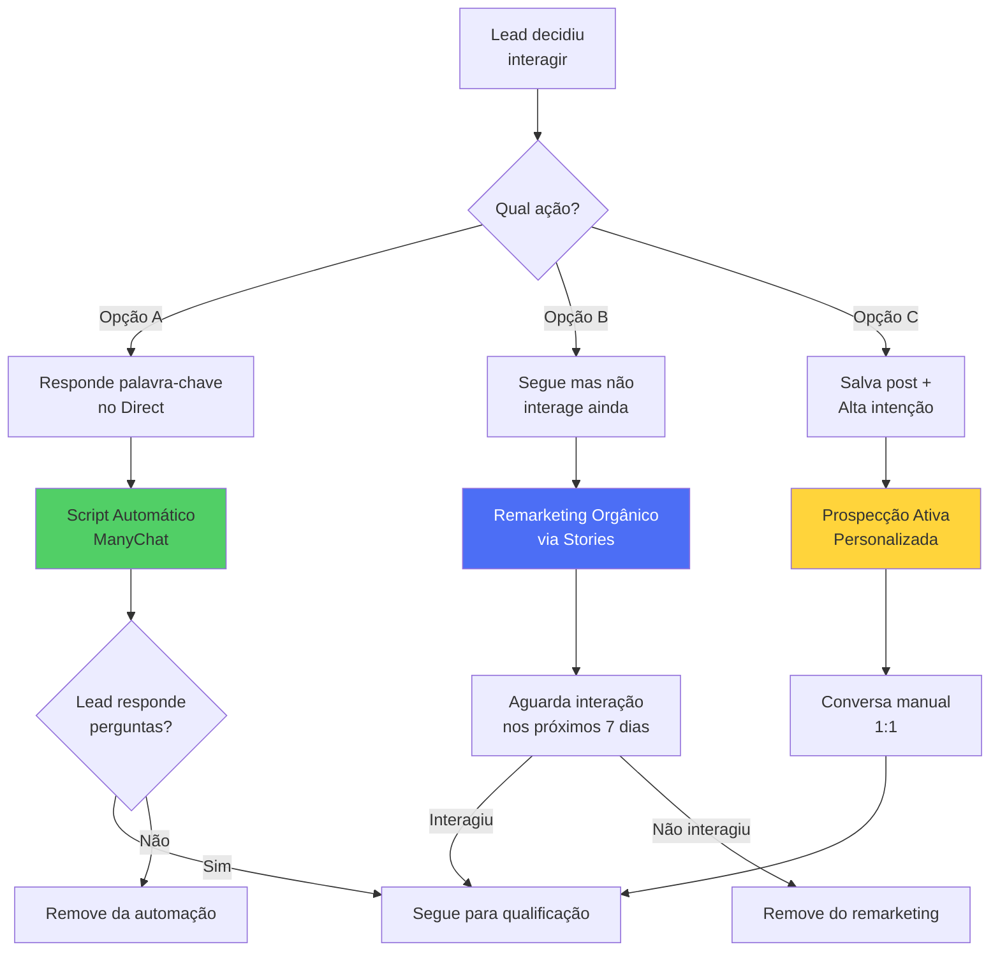

---

### 📍 ETAPA 4: QUALIFICAÇÃO (Perguntas Estratégicas)

**Fluxo do Script Automático (ManyChat):**

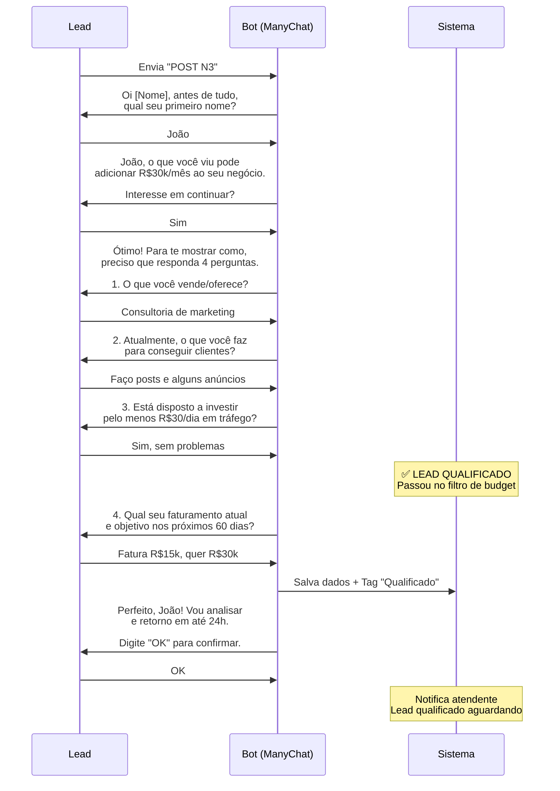

#### 🔍 Por que a PERGUNTA 3 é crítica?

**Pergunta 3: "Está disposto a investir pelo menos R$30/dia em tráfego?"**

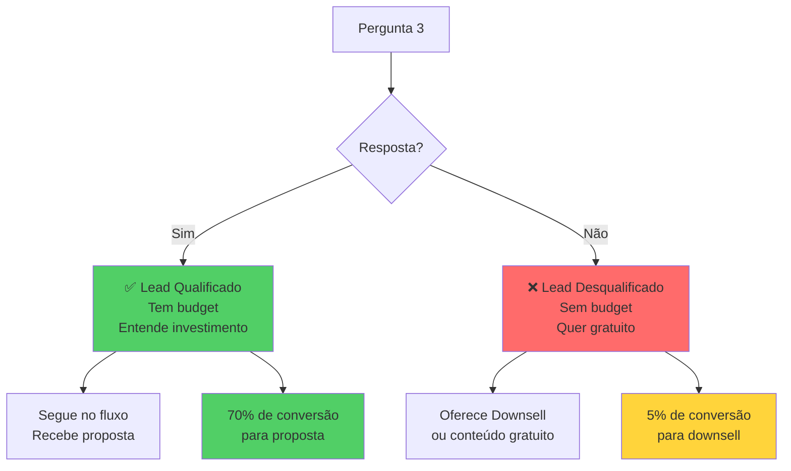

**Por que colocar no MEIO do questionário (não no início)?**
- ✅ Lead já investiu tempo respondendo pergunta 1 e 2 (compromisso)
- ✅ Lead já está "dentro" da conversa (engajamento)
- ✅ Se colocar no início, assusta antes de gerar interesse
- ✅ Se colocar no final, desperdiça tempo qualificando quem não tem budget

---

### 📍 ETAPA 5: CONVERSÃO (Apenas Leads Qualificados)

**Lead qualificado recebe proposta personalizada:**

```
┌─────────────────────────────────────────┐
│  Olá João!                              │
│                                         │
│  Analisei suas respostas:               │
│  ✅ Vende consultoria de marketing      │
│  ✅ Já faz anúncios (nível 3-4)         │
│  ✅ Budget de R$30/dia ok               │
│  ✅ Meta: dobrar faturamento (R$15k→30k)│
│                                         │
│  Faz todo sentido trabalharmos juntos. │
│                                         │
│  Vou te entregar:                       │
│  1. 9 Posts N3 prontos                  │
│  2. Script Automático configurado       │
│  3. Campanha de anúncios estruturada    │
│  4. 30 dias de suporte                  │
│                                         │
│  Investimento: R$X.XXX                  │
│  (3x seu objetivo mensal)               │
│                                         │
│  Quando você quer começar?              │
└─────────────────────────────────────────┘
```

**Taxa de conversão esperada:**
- Lead qualificado → Proposta: **60-70%**
- Lead desqualificado → Downsell: **5-10%**

---

# 🎯 MÓDULO 3: META ADS - ESTRATÉGIA COMPLETA
> ⏱️ Duração: 30 minutos

---

## 3.1 - MINDSET ANTI-COMUM

### ⚖️ Comparação: Estratégia Comum vs Nossa Estratégia

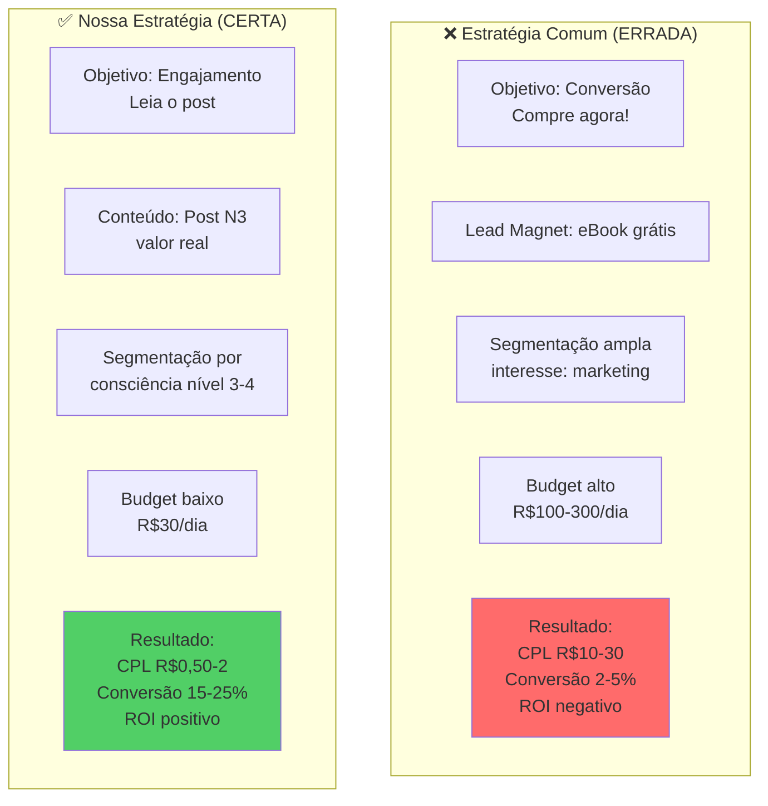

---

## 3.2 - ESTRUTURA DAS 3 CAMPANHAS (FUNIL COMPLETO)

### 🔝 CAMPANHA 1: TOPO DE FUNIL - Distribuição de Posts N3

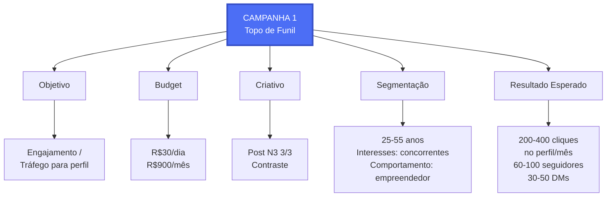

#### 📝 Copy do Anúncio (Modelo)

```
┌─────────────────────────────────────────────────┐
│ [Imagem: Card 1 do Post N3 - Contraste]         │
│                                                 │
│ Se você ainda [SOLUÇÃO COMUM], está perdendo   │
│ tempo e dinheiro.                               │
│                                                 │
│ Para [PÚBLICO ALVO] que já tentaram:           │
│ • [Solução Comum 1]                             │
│ • [Solução Comum 2]                             │
│ • [Solução Comum 3]                             │
│                                                 │
│ E ainda enfrentam [EFEITO COLATERAL].          │
│                                                 │
│ Existe uma forma mais simples: [MÉTODO].       │
│                                                 │
│ 👉 Leia o post completo                         │
└─────────────────────────────────────────────────┘
```

#### 🎯 Segmentação Detalhada

**Localização:**
- Brasil (ou seu país)
- Cidades principais (capitais + interior com 100k+ hab)

**Idade:**
- 25-55 anos (sweet spot: 30-45)

**Interesses (escolher 3-5):**
- Concorrentes diretos do seu nicho
- Ferramentas que seu público usa (ex: RD Station, HubSpot, ActiveCampaign)
- Gurus/influencers que seu público segue
- Soluções Comuns do mercado

**Comportamentos:**
- Proprietários de pequenas empresas
- Tomadores de decisão
- Compradores frequentes online (alto valor)

**Tamanho do público ideal:**
- 500k - 2M (Brasil)
- Muito amplo (>5M): diluir
- Muito restrito (<200k): expandir

#### 📊 Métricas da Campanha 1

| Métrica | Meta | Como Calcular |
|---------|------|---------------|
| **CPM** (Custo por mil impressões) | R$15-30 | R$ gasto ÷ Impressões × 1000 |
| **CPC** (Custo por clique) | R$0,30-0,80 | R$ gasto ÷ Cliques no post |
| **Clique no Perfil** | 200-400/mês | Via Instagram Insights |
| **Custo por Clique no Perfil** | R$0,50-2,00 | R$ gasto ÷ Cliques no perfil |
| **Taxa de Salvamento** | 5-10% | Salvamentos ÷ Alcance × 100 |
| **Visitante → Seguidor** | 15-25% | Novos seguidores ÷ Cliques perfil × 100 |

**Exemplo real (Budget R$30/dia por 30 dias = R$900):**
```
Impressões: 45.000
Cliques no post: 1.500 (CPM: R$20, CPC: R$0,60)
Cliques no perfil: 400 (Custo: R$2,25 cada)
Novos seguidores: 80 (20% conversão)
DMs recebidos: 35 (43% dos seguidores)
Leads qualificados: 20 (57% dos DMs)
Vendas: 3 (15% dos qualificados)

ROI: 3 vendas × R$2.000 = R$6.000
Investimento: R$900
Lucro: R$5.100 (567% ROI)
```

---

### 🎯 CAMPANHA 2: MEIO DE FUNIL - Remarketing para Engajados

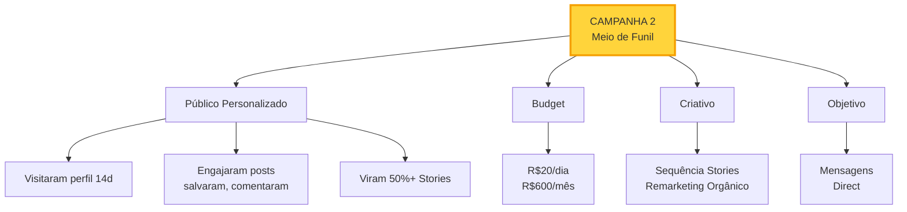

#### 📝 Copy do Anúncio Stories (Modelo)

```
┌─────────────────────────┐
│ Story 1/3               │
│                         │
│ Você viu meu post sobre │
│ [MÉTODO].               │
│                         │
│ Mais de [X] pessoas já  │
│ usam isso para          │
│ [RESULTADO].            │
│                         │
│ ⬆️ Deslize              │
└─────────────────────────┘

┌─────────────────────────┐
│ Story 2/3               │
│                         │
│ Sem precisar:           │
│ ❌ [Solução Comum 1]    │
│ ❌ [Solução Comum 2]    │
│ ❌ [Solução Comum 3]    │
│                         │
│ Apenas [MÉTODO RESUMIDO]│
│                         │
│ ⬆️ Deslize              │
└─────────────────────────┘

┌─────────────────────────┐
│ Story 3/3               │
│                         │
│ Quer saber como aplicar │
│ no seu negócio?         │
│                         │
│ Responda no Direct:     │
│ [PALAVRA-CHAVE]         │
│                         │
│ 👆 Enviar Mensagem      │
└─────────────────────────┘
```

#### 🎯 Como Criar o Público Personalizado

**No Meta Ads Manager:**

1. **Públicos → Criar Público → Público Personalizado**

2. **Escolher Fonte:**
   - Instagram Business Account

3. **Criar combinação:**
```
Incluir pessoas que:
  ☑️ Visitaram seu perfil (últimos 14 dias)
  OU
  ☑️ Interagiram com qualquer post (últimos 14 dias)
  OU
  ☑️ Enviaram mensagem (últimos 14 dias)

EXCLUIR:
  ☑️ Já compraram (lista de clientes)
```

**Tamanho esperado:** 500-5.000 pessoas (dependendo do tráfego)

#### 📊 Métricas da Campanha 2

| Métrica | Meta | Observação |
|---------|------|------------|
| **CPM** | R$25-40 | Mais caro (público menor) |
| **CPC** | R$0,80-1,50 | Público quente paga mais |
| **Taxa de Clique Stories** | 10-20% | Muito maior que cold |
| **Custo por DM** | R$3-8 | Custo de aquisição de conversa |
| **Taxa de Conversão DM → Venda** | 25-40% | Público pré-aquecido |

---

### 💰 CAMPANHA 3: FUNDO DE FUNIL - Conversão Direta

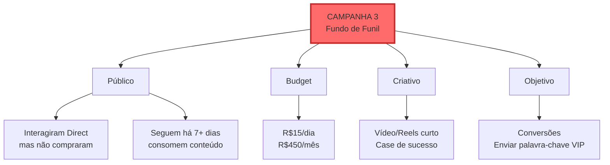

#### 🎥 Estrutura do Vídeo/Reels (15-30s)

**Formato vencedor:**

```
[00s-03s] GANCHO
"Como [Nome Cliente] saiu de R$X para R$Y
em [tempo] usando [Método]"

[03s-10s] PROBLEMA
"Ele estava preso em [Soluções Comuns]
e enfrentando [Efeito Colateral]"

[10s-20s] SOLUÇÃO
"Implementamos [Método]:
• Passo 1
• Passo 2
• Passo 3"

[20s-28s] RESULTADO
"Resultado: R$Y em [tempo]
Sem [Efeito Colateral]"

[28s-30s] CTA
"Quer o mesmo? Responda VIP no Direct"
```

#### 📊 Métricas da Campanha 3

| Métrica | Meta | Observação |
|---------|------|------------|
| **Custo por Resultado** | R$10-25 | Palavra-chave enviada |
| **Taxa de Conversão** | 40-60% | Público ultra-quente |
| **CAC** (Custo Aquisição Cliente) | R$150-400 | Depende do ticket |

---

## 3.3 - CRIATIVOS QUE CONVERTEM

### 📊 Os 3 Tipos de Criativos (Quando usar cada um)

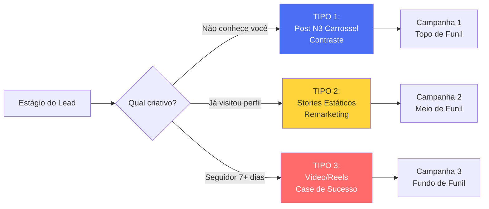

---

### 🎨 TIPO 1: Posts N3 (Carrossel)

**Qual dos 3 Posts Fixados usar no anúncio?**

| Post Fixado | Quando usar | Taxa de Clique Esperada |
|-------------|-------------|------------------------|
| **1/3 - Explicativo** | Lead nível 2-3 consciência (sabe problema, não sabe sua solução) | 2-4% |
| **2/3 - Transformação** | Lead nível 3 (quer visualizar resultado) | 3-5% |
| **3/3 - Contraste** ⭐ | Lead nível 3-4 (já tentou Soluções Comuns) | **5-8%** |

**Por que o 3/3 (Contraste) é o vencedor?**
```mermaid
graph TD
    A[Post 3/3<br/>Contraste] --> B[Afirmação Provocativa]
    B --> C[Lead pensa:<br/>'Como assim?']
    C --> D[Polarização ativada]
    D --> E[Lê para entender]
    E --> F[Identifica com<br/>Efeito Colateral]
    F --> G[Vê seu Método<br/>como solução superior]
    G --> H[Clica no perfil]

    style A fill:#51cf66,stroke:#2f9e44,stroke-width:3px
```

#### ✅ Checklist para testar variações do Post N3

- [ ] Testar Card 1 com diferentes afirmações provocativas
- [ ] Testar CTA diferente no último card ("Comente POST" vs "Mande DM")
- [ ] Testar ordem dos cards (começar com case vs começar com problema)
- [ ] Testar design (minimalista vs colorido)
- [ ] Testar quantidade de cards (6 vs 8 vs 10)

**Regra de ouro:** Mude UMA variável por vez para saber o que funciona.

---

### 📱 TIPO 2: Stories Estáticos (6-14 cards)

**Estrutura vencedora (Sequência de 8 Stories):**

```
Story 1: Resultado impressionante
"R$50k em 2 semanas vendendo [serviço] usando [Método]"

Story 2: "Como?"
"Sem [Solução Comum 1], [Solução Comum 2] ou [Solução Comum 3]"

Story 3: Introdução do Método
"Usando apenas [Método resumido em 1 linha]"

Story 4: Prova Social
"[X] pessoas já usam. Case: [resultado de cliente]"

Story 5: O Segredo
"O segredo? [Princípio único do método]"

Story 6: Benefício Principal
"Para que você possa [benefício emocional]"

Story 7: Teaser
"Segunda-feira vou mostrar exatamente como fazer isso"

Story 8: CTA
"Se quiser acesso antes, responda: ACESSO"
```

**Por que funciona?**
- ✅ Formato nativo do Instagram (menos "cara de anúncio")
- ✅ Storytelling em camadas (prende atenção)
- ✅ CTA no final (depois de gerar desejo)

---

### 🎥 TIPO 3: Vídeo/Reels Curto (15-30s)

**Anatomia de um Reels que converte:**

```mermaid
sequenceDiagram
    participant V as Vídeo
    participant L as Lead
    participant E as Emoção

    Note over V: 00s-03s: GANCHO
    V->>L: Mostra resultado chocante
    L->>E: Curiosidade ativada

    Note over V: 03s-10s: PROBLEMA
    V->>L: "Ele estava preso em X"
    L->>E: Identificação

    Note over V: 10s-20s: SOLUÇÃO
    V->>L: "Fizemos Y em 3 passos"
    L->>E: Esperança

    Note over V: 20s-28s: RESULTADO
    V->>L: "Alcançou Z sem W"
    L->>E: Desejo

    Note over V: 28s-30s: CTA
    V->>L: "Responda VIP no Direct"
    L->>E: Urgência de agir
```

**Elementos visuais que aumentam retenção:**
- ✅ Legenda chamativa nos primeiros 3s
- ✅ Transições rápidas (cortes a cada 3-5s)
- ✅ B-roll mostrando "prova" (print de resultado, depoimento, etc)
- ✅ Música trending (aumenta alcance orgânico)
- ✅ Você aparecendo (humaniza, gera conexão)

---

### 📝 FÓRMULA UNIVERSAL DE COPY PARA ANÚNCIOS

```
[LINHA 1: Afirmação Provocativa que gera Polarização]
"Se você ainda [Solução Comum], está [consequência negativa]."

[LINHA 2: Validação do Problema Sofisticado]
"Para [Público Alvo] que já tentaram [Soluções Comuns]
e ainda enfrentam [Efeito Colateral]."

[LINHA 3: Introdução do Método - 1 linha]
"Existe uma forma mais simples: [Método]."

[LINHA 4: CTA claro]
"👉 [Ação desejada]"
```

**Exemplo aplicado (Nutricionista):**
```
Se você ainda faz dietas restritivas para emagrecer,
está sabotando seu próprio metabolismo.

Para mulheres 35+ que já tentaram low-carb, jejum
intermitente e shakes detox, mas voltam a engordar
toda vez que param.

Existe uma forma mais simples: Emagrecimento Metabólico.

👉 Leia o post completo
```

---

## 3.4 - MÉTRICAS QUE REALMENTE IMPORTAM

### ❌ Métricas de Vaidade (Ignore)

```mermaid
graph LR
    A[Métricas de Vaidade] --> B[Alcance Total]
    A --> C[Impressões]
    A --> D[Curtidas]
    A --> E[Visualizações de Vídeo]

    B --> F[Não geram R$]
    C --> F
    D --> F
    E --> F

    style F fill:#ff6b6b
```

**Por que ignorar?**
- 100.000 impressões não pagam conta
- 500 curtidas não viram clientes
- Alcance sem conversão = vaidade

---

### ✅ Métricas que Geram R$ (Foque Aqui)

```mermaid
graph TD
    A[Métricas de Resultado] --> B[Taxa de Salvamento]
    A --> C[Custo por Clique no Perfil]
    A --> D[Visitante → Seguidor]
    A --> E[Seguidor → DM]
    A --> F[DM → Lead Qualificado]
    A --> G[Lead → Cliente]

    B --> H[Indica relevância<br/>do conteúdo]
    C --> I[Indica eficiência<br/>do anúncio]
    D --> J[Indica qualidade<br/>do perfil]
    E --> K[Indica força<br/>da oferta]
    F --> L[Indica filtro<br/>de qualificação]
    G --> M[Indica ROI<br/>da campanha]

    style M fill:#51cf66,stroke:#2f9e44,stroke-width:3px
```

---

### 📊 Funil de Conversão Completo (Com Benchmarks)

```mermaid
graph TD
    A[10.000 Impressões<br/>R$30 investidos] --> B[500 Cliques no Post<br/>CPM: R$20 / CPC: R$0,06]

    B --> C[150 Cliques no Perfil<br/>Taxa: 30%<br/>Custo: R$0,20 cada]

    C --> D[37 Novos Seguidores<br/>Taxa: 25%<br/>Custo: R$0,81 cada]

    D --> E[18 DMs Recebidos<br/>Taxa: 48%<br/>Custo: R$1,67 cada]

    E --> F[10 Leads Qualificados<br/>Taxa: 55%<br/>Custo: R$3 cada]

    F --> G[2 Vendas<br/>Taxa: 20%<br/>Custo: R$15 cada]

    G --> H[Faturamento: R$4.000<br/>Investimento: R$30<br/>Lucro: R$3.970<br/>ROI: 13.233%]

    style H fill:#51cf66,stroke:#2f9e44,stroke-width:4px

    class A,B,C,D,E,F azul
    classDef azul fill:#4c6ef5,color:#fff
```

---

### 📋 Dashboard de Acompanhamento (Planilha)

**Métricas Diárias:**

| Data | Budget | Impressões | CPM | Cliques Post | CPC | Cliques Perfil | Custo/Perfil | Seguidores | DMs | Vendas |
|------|--------|-----------|-----|--------------|-----|----------------|--------------|-----------|-----|--------|
| 01/01 | R$30 | 8.500 | R$21 | 420 | R$0,07 | 110 | R$0,27 | 25 | 12 | 1 |
| 02/01 | R$30 | 9.200 | R$19 | 480 | R$0,06 | 135 | R$0,22 | 30 | 14 | 1 |
| ... | ... | ... | ... | ... | ... | ... | ... | ... | ... | ... |

**Métricas Acumuladas (30 dias):**

| Métrica | Total | Benchmark | Status |
|---------|-------|-----------|--------|
| Investimento | R$900 | - | - |
| Impressões | 280.000 | - | - |
| Cliques Perfil | 3.800 | 200-400 | ✅ Acima |
| Novos Seguidores | 850 | 60-100 | ✅ Muito acima |
| DMs Qualificados | 180 | 30-50 | ✅ Muito acima |
| Vendas | 28 | 3-8 | ✅ Excepcional |
| Faturamento | R$56.000 | R$6k-16k | ✅ Excepcional |
| ROI | 6.122% | 300-1000% | ✅ Acima |

---

### 🚨 Sinais de Alerta (Quando Ajustar)

```mermaid
graph TD
    A{Qual métrica<br/>está ruim?} --> B[CPM > R$40]
    A --> C[CPC > R$1,00]
    A --> D[Cliques Perfil < 100/mês]
    A --> E[Visitante→Seguidor < 10%]
    A --> F[Seguidor→DM < 20%]
    A --> G[DM→Venda < 10%]

    B --> B1[Problema:<br/>Público saturado]
    B1 --> B2[Solução:<br/>Trocar interesses]

    C --> C1[Problema:<br/>Criativo fraco]
    C1 --> C2[Solução:<br/>Testar novo Post N3]

    D --> D1[Problema:<br/>Copy não gera clique]
    D1 --> D2[Solução:<br/>Afirmação mais provocativa]

    E --> E1[Problema:<br/>Perfil desalinhado]
    E1 --> E2[Solução:<br/>Revisar Posts Fixados]

    F --> F1[Problema:<br/>CTA fraco]
    F1 --> F2[Solução:<br/>Melhorar Stories/Oferta]

    G --> G1[Problema:<br/>Qualificação ruim]
    G1 --> G2[Solução:<br/>Refinar perguntas Script]

    style B1 fill:#ff6b6b
    style C1 fill:#ff6b6b
    style D1 fill:#ff6b6b
    style E1 fill:#ff6b6b
    style F1 fill:#ff6b6b
    style G1 fill:#ff6b6b
```

---

# 🎯 MÓDULO 4: PROSPECÇÃO ATIVA ESTRATÉGICA
> ⏱️ Duração: 20 minutos

---

## 4.1 - QUANDO FAZER PROSPECÇÃO (Regra de Ouro)

### 🚫 NÃO Prospectar (Desperdício de Tempo)

```mermaid
graph TD
    A[NÃO Prospectar] --> B[Pessoas que nunca<br/>ouviram falar de você]
    A --> C[Listas compradas<br/>de contatos]
    A --> D[Seguidores de concorrentes<br/>sem critério]
    A --> E[Qualquer um que<br/>'pode ser cliente']

    B --> F[Taxa de resposta:<br/>< 5%]
    C --> F
    D --> F
    E --> F

    F --> G[ROI Negativo<br/>Tempo desperdiçado]

    style G fill:#ff6b6b,stroke:#c92a2a,stroke-width:3px
```

**Por que NÃO funciona?**
- Lead frio não te conhece = rejeição
- Você parece spam
- Você está "interrompendo" (outbound agressivo)
- Mesmo que responda, não está qualificado

---

### ✅ SIM Prospectar (Alto ROI)

```mermaid
graph TD
    A[SIM Prospectar] --> B[Salvou seu Post N3<br/>mas não seguiu]
    A --> C[Visualiza Stories<br/>consistentemente<br/>mas não interage]
    A --> D[Seguiu, consumiu conteúdo<br/>mas não enviou palavra-chave]
    A --> E[Lead de anúncio<br/>não converteu<br/>mas é qualificado]

    B --> F[Taxa de resposta:<br/>30-50%]
    C --> F
    D --> F
    E --> F

    F --> G[ROI Positivo<br/>Conversão 15-25%]

    style G fill:#51cf66,stroke:#2f9e44,stroke-width:3px
```

**Por que FUNCIONA?**
- Lead já demonstrou interesse (salvou post, visualiza stories)
- Você está "ajudando", não interrompendo
- Lead está em nível 3-4 de consciência
- Prospecção é um "empurrão gentil"

---

### 🎯 Princípio Fundamental

> ## "Prospecção Ativa não é para ENCONTRAR leads."
> ## "É para REATIVAR leads que já demonstraram interesse."

```mermaid
graph LR
    A[Lead Demonstrou<br/>Interesse] --> B{Por que não<br/>interagiu?}

    B -->|Esqueceu| C[Lembrar ele<br/>Prospecção]
    B -->|Ficou em dúvida| D[Esclarecer dúvida<br/>Prospecção]
    B -->|Timidez| E[Facilitar contato<br/>Prospecção]

    C --> F[Conversão]
    D --> F
    E --> F

    style F fill:#51cf66
```

---

## 4.2 - SCRIPT DE PROSPECÇÃO (Modelo Completo)

### 📋 Contexto do Exemplo

**Situação:** Lead salvou seu Post N3 sobre [Método] há 3 dias, mas não te seguiu nem enviou DM.

**Objetivo:** Abrir conversa relevante e qualificar interesse.

---

### 💬 MENSAGEM 1: Abertura (Contexto + Pergunta)

```
┌─────────────────────────────────────────┐
│  Oi [Nome], tudo bem?                   │
│                                         │
│  Vi que você salvou meu post sobre      │
│  [Método].                              │
│                                         │
│  Fiquei curioso: você já tentou         │
│  [Solução Comum] antes de encontrar     │
│  meu conteúdo?                          │
└─────────────────────────────────────────┘
```

**Anatomia da mensagem:**
```mermaid
graph LR
    A[Oi + Nome] --> B[Contexto:<br/>Salvou o post]
    B --> C[Pergunta relevante<br/>sobre Solução Comum]

    C --> D[Lead pensa:<br/>'Ele prestou atenção<br/>no que eu fiz']

    style D fill:#4c6ef5,color:#fff
```

**Por que funciona:**
- ✅ Personalizada (menciona ação específica)
- ✅ Não é genérica ("Oi, tudo bem?")
- ✅ Pergunta fácil de responder (sim/não + contexto)
- ✅ Abre espaço para conversa relevante

**Taxa de resposta esperada:** 30-50%

---

### 💬 MENSAGEM 2: Empatia + Apresentação (Se responder "Sim")

```
┌─────────────────────────────────────────┐
│  Imagino que tenha enfrentado           │
│  [Efeito Colateral], certo?             │
│                                         │
│  (É o que mais ouço por aqui)           │
│                                         │
│  É exatamente por isso que criei        │
│  o [Método].                            │
│                                         │
│  Quer que eu te mostre como funciona    │
│  na prática?                            │
└─────────────────────────────────────────┘
```

**Anatomia:**
```mermaid
sequenceDiagram
    participant V as Você
    participant L as Lead

    V->>L: Valida Efeito Colateral
    Note over L: 'Ele me entende!'
    L->>V: Empatia ativada

    V->>L: Apresenta Método como solução
    Note over L: 'Isso faz sentido'
    L->>V: Interesse aumenta

    V->>L: Pergunta se quer saber mais
    Note over L: 'É só dizer sim'
    L->>V: Sim!
```

**Por que funciona:**
- ✅ Valida o problema (empatia)
- ✅ Mostra que não é caso isolado ("é o que mais ouço")
- ✅ Apresenta Método como solução específica
- ✅ CTA fácil e sem compromisso ("quer que eu te mostre")

**Taxa de avanço esperada:** 60-80% (dos que responderam msg 1)

---

### 💬 MENSAGEM 3: Qualificação (Se responder "Sim, quero saber")

```
┌─────────────────────────────────────────┐
│  Perfeito!                              │
│                                         │
│  Para eu te mostrar o caminho certo,    │
│  preciso entender 3 coisas:             │
│                                         │
│  1. O que você vende/oferece?           │
│                                         │
│  2. Qual sua estratégia atual para      │
│     conseguir clientes?                 │
│                                         │
│  3. Qual seu objetivo de faturamento    │
│     nos próximos 60 dias?               │
│                                         │
│  (Pode responder tudo de uma vez 👇)    │
└─────────────────────────────────────────┘
```

**Anatomia:**
```mermaid
graph TD
    A[Mensagem 3] --> B[Pergunta 1:<br/>O que vende]
    A --> C[Pergunta 2:<br/>Estratégia atual]
    A --> D[Pergunta 3:<br/>Objetivo]

    B --> E[Identifica nicho]
    C --> F[Identifica nível<br/>de consciência]
    D --> G[Identifica qualificação<br/>financeira]

    E --> H{Decisão}
    F --> H
    G --> H

    H -->|Qualificado| I[Apresenta proposta<br/>personalizada]
    H -->|Não qualificado| J[Oferece downsell<br/>ou conteúdo]

    style I fill:#51cf66
    style J fill:#ffd43b
```

**Por que NÃO perguntar sobre budget diretamente?**
- ❌ "Você tem R$X para investir?" = resposta defensiva
- ✅ "Qual seu objetivo de faturamento?" = revela capacidade indireta

**Taxa de resposta esperada:** 70-90% (dos que chegaram aqui)

---

### 💬 MENSAGEM 4: Proposta ou Próximo Passo

**Cenário A: Lead qualificado (Budget ok, nicho adequado)**

```
┌─────────────────────────────────────────┐
│  Show, [Nome]!                          │
│                                         │
│  Baseado no que você falou:             │
│  ✅ [Resume nicho]                      │
│  ✅ [Resume estratégia atual]           │
│  ✅ [Resume objetivo]                   │
│                                         │
│  Faz MUITO sentido a gente trabalhar    │
│  junto.                                 │
│                                         │
│  Vou te passar o que eu faria:          │
│  [Link ou áudio explicando proposta]    │
│                                         │
│  Dá uma olhada e me diz o que achou 👍  │
└─────────────────────────────────────────┘
```

**Cenário B: Lead não qualificado (Sem budget ou nicho não atende)**

```
┌─────────────────────────────────────────┐
│  Entendi, [Nome].                       │
│                                         │
│  Pelo que você falou, no momento        │
│  meu serviço principal não é o ideal    │
│  pra você.                              │
│                                         │
│  MAS, tenho algo que pode te ajudar:    │
│  [Oferece downsell ou conteúdo grátis]  │
│                                         │
│  Interesse?                             │
└─────────────────────────────────────────┘
```

---

### 📊 Fluxo Completo da Prospecção (Taxas de Conversão)

```mermaid
graph TD
    A[100 Leads Salvaram Post<br/>Não seguiram] --> B[Envia Mensagem 1]

    B --> C[40 Respondem<br/>Taxa: 40%]

    C --> D[30 Interessados<br/>em saber mais<br/>Taxa: 75%]

    D --> E[27 Respondem<br/>perguntas de qualificação<br/>Taxa: 90%]

    E --> F{Qualificados?}

    F -->|Sim| G[18 Leads Qualificados<br/>Taxa: 67%]
    F -->|Não| H[9 Não Qualificados<br/>Taxa: 33%]

    G --> I[4 Vendas<br/>Taxa conversão: 22%]

    I --> J[Faturamento: R$8.000<br/>Tempo investido: 3h<br/>ROI: R$2.666/hora]

    style J fill:#51cf66,stroke:#2f9e44,stroke-width:3px
```

**Análise:**
- Tempo médio por mensagem: 2min
- 100 leads × 2min = 3h20min total
- 4 vendas × R$2.000 = R$8.000
- ROI: R$2.400/hora (vs salário de R$50/hora em trabalho comum)

---

## 4.3 - PROCESSO DE PROSPECÇÃO ESTRUTURADO (Semanal)

### 📅 Cronograma da Semana

```mermaid
gantt
    title Rotina Semanal de Prospecção (30min/dia)
    dateFormat  YYYY-MM-DD
    section Segunda
    Exportar lista de salvamentos :a1, 2025-01-13, 30m
    Filtrar quem NÃO segue :a2, after a1, 30m
    section Terça
    Enviar 20 mensagens (Lote 1) :b1, 2025-01-14, 30m
    section Quarta
    Enviar 20 mensagens (Lote 2) :c1, 2025-01-15, 30m
    Responder mensagens de ontem :c2, after c1, 30m
    section Quinta
    Follow-up quem não respondeu :d1, 2025-01-16, 30m
    Qualificar leads que avançaram :d2, after d1, 30m
    section Sexta
    Apresentar propostas :e1, 2025-01-17, 30m
    Fechar vendas :e2, after e1, 30m
```

---

### 🗓️ SEGUNDA-FEIRA: Setup

**Atividade:** Exportar lista + Filtrar

**Como fazer:**

1. **Exportar lista de salvamentos:**
   - Ferramenta: Instagram Insights (nativo) ou Metricool/Iconosquare (pago)
   - Navegue até o Post N3 que está rodando anúncio
   - Veja "Salvamentos" → Exportar lista de usuários

2. **Filtrar apenas quem NÃO segue:**
   - Copiar lista de usernames
   - Colar em planilha
   - Manualmente ou via ferramenta, verificar quem não te segue
   - Resultado: Lista limpa de 30-50 leads

**Planilha de controle:**

| Username | Nome | Data Salvamento | Status Follow | Enviada MSG? | Respondeu? | Qualificado? |
|----------|------|-----------------|---------------|--------------|-----------|--------------|
| @joaosilva | João Silva | 08/01 | ❌ Não | - | - | - |
| @mariacoach | Maria Oliveira | 09/01 | ❌ Não | - | - | - |

---

### 🗓️ TERÇA/QUARTA: Envio em Lotes

**Atividade:** Enviar 20-30 mensagens por dia

**Por que em lotes?**
- Evita spam flag do Instagram
- Permite responder no dia seguinte (não fica acumulado)
- Mais sustentável (30min/dia vs 2h de uma vez)

**Processo:**
1. Abrir Instagram no celular
2. Buscar username da planilha
3. Enviar Mensagem 1 (copy salvo em bloco de notas)
4. Personalizar [Nome] e [Solução Comum] rapidamente
5. Marcar na planilha "Enviada"
6. Próxima

**Tempo médio:** 1-2 min por mensagem = 20-40 min para 20 mensagens

---

### 🗓️ QUINTA/SEXTA: Qualificação + Fechamento

**Atividade:** Responder + Qualificar + Fechar

**Quinta:**
- Responder quem respondeu Mensagem 1 ontem (enviar Mensagem 2)
- Fazer follow-up leve em quem não respondeu:
  ```
  "E aí, [Nome]? Viu minha mensagem?
  Ficou alguma dúvida?"
  ```

**Sexta:**
- Qualificar leads que responderam perguntas (enviar Mensagem 3)
- Apresentar proposta para qualificados (Mensagem 4 - Cenário A)
- Oferecer downsell para não qualificados (Mensagem 4 - Cenário B)

---

### 📊 Métricas Semanais (Acompanhar)

| Métrica | Meta | Sua Realidade |
|---------|------|---------------|
| Leads prospectados | 40-50 | ___ |
| Taxa de resposta | 30-40% | ___% |
| Respostas → Interessados | 70-80% | ___% |
| Interessados → Qualificados | 60-70% | ___% |
| Qualificados → Venda | 20-30% | ___% |
| **Vendas totais/semana** | **3-6** | **___** |

**Se estiver abaixo da meta, revisar:**
- Copy da Mensagem 1 (muito genérica?)
- Timing (mandar à noite vs manhã)
- Qualificação (está filtrando bem?)
- Proposta (preço adequado? Valor claro?)

---

### ⚙️ Ferramentas para Escalar Prospecção

| Ferramenta | Função | Preço | Vale a pena? |
|------------|--------|-------|--------------|
| **Metricool** | Exportar lista de salvamentos | R$50/mês | ✅ Sim (economiza 1h/semana) |
| **Iconosquare** | Analytics avançado Instagram | R$80/mês | ⚖️ Opcional (se faturar >R$20k) |
| **Notion/Airtable** | Planilha de acompanhamento | Grátis | ✅ Sim |
| **Manychat** | Automação de respostas | R$45/mês | ✅ Sim (essencial) |

---

# 🔄 MÓDULO 5: COMBINANDO TRÁFEGO + PROSPECÇÃO
> ⏱️ Duração: 15 minutos

---

## 5.1 - ESTRATÉGIA HÍBRIDA (O Melhor dos 2 Mundos)

### 🎯 Por que combinar Inbound + Outbound?

```mermaid
graph TD
    subgraph "❌ Só Tráfego (Inbound)"
        A1[Leads chegam sozinhos] --> A2[MAS: Alguns não convertem]
        A2 --> A3[Desperdiça oportunidade]
    end

    subgraph "❌ Só Prospecção (Outbound)"
        B1[Você busca leads] --> B2[MAS: Volume limitado]
        B2 --> B3[Não escala]
    end

    subgraph "✅ Tráfego + Prospecção (Híbrido)"
        C1[Anúncios geram leads inbound] --> C2[Salvaram mas não seguiram?]
        C2 --> C3[Prospecção reativa eles]
        C3 --> C4[Seguiram mas não interagiram?]
        C4 --> C5[Remarketing via Stories]
        C5 --> C6[Interagiram mas não compraram?]
        C6 --> C7[Prospecção personalizada]
        C7 --> C8[Conversão máxima<br/>Funil sem vazamento]
    end

    style C8 fill:#51cf66,stroke:#2f9e44,stroke-width:3px
```

**Vantagens da estratégia híbrida:**
- ✅ Não desperdiça NENHUM lead
- ✅ Escala via tráfego
- ✅ Personaliza via prospecção
- ✅ ROI 30-50% maior

---

## 5.2 - CRONOGRAMA DE IMPLEMENTAÇÃO (0 a 5+ semanas)

### 📅 Semana 1-2: SETUP (Fundação)

```mermaid
gantt
    title Semanas 1-2: Construindo a Base
    dateFormat  YYYY-MM-DD
    section Conteúdo
    Criar Post 1/3 Explicativo :done, a1, 2025-01-13, 2d
    Criar Post 2/3 Transformação :done, a2, after a1, 2d
    Criar Post 3/3 Contraste :active, a3, after a2, 2d
    Publicar e Fixar os 3 Posts :a4, after a3, 1d
    section Automação
    Configurar ManyChat :b1, after a4, 2d
    Criar Script Automático :b2, after b1, 1d
    Testar fluxo completo :b3, after b2, 1d
    section Tráfego
    Criar conta Ads Manager :c1, after a4, 1d
    Configurar Campanha 1 :c2, after c1, 1d
    Lançar com R$30/dia :c3, after c2, 1d
```

**Checklist Semana 1-2:**

- [ ] **Conteúdo:**
  - [ ] 3 Posts N3 criados e publicados
  - [ ] Fixados no perfil
  - [ ] Bio otimizada
  - [ ] Destaque "Comece Aqui" configurado

- [ ] **Automação:**
  - [ ] ManyChat instalado e conectado
  - [ ] Script Automático de 8 blocos configurado
  - [ ] Palavra-chave ativa
  - [ ] Teste realizado (você enviando palavra-chave)

- [ ] **Tráfego:**
  - [ ] Conta Meta Ads criada
  - [ ] Método de pagamento adicionado
  - [ ] Campanha 1 configurada (Post 3/3)
  - [ ] Budget R$30/dia ativo

**Não fazer ainda:**
- ❌ Rodar Campanha 2 ou 3 (precisa de público personalizado)
- ❌ Começar prospecção (precisa ter leads primeiro)

---

### 📅 Semana 3-4: OTIMIZAÇÃO (Ajustes)

```mermaid
gantt
    title Semanas 3-4: Otimizando o Sistema
    dateFormat  YYYY-MM-DD
    section Análise
    Revisar métricas Campanha 1 :a1, 2025-01-27, 1d
    Identificar Post com + salvamentos :a2, after a1, 1d
    section Otimização
    Aumentar budget criativo vencedor :b1, after a2, 1d
    Pausar criativos ruins :b2, after a2, 1d
    Criar Público Personalizado (14d) :b3, after a2, 1d
    section Prospecção
    Exportar lista salvamentos :c1, after b3, 1d
    Começar prospecção ativa :c2, after c1, 5d
    section Remarketing
    Lançar Campanha 2 (Stories) :d1, after b3, 1d
```

**Checklist Semana 3-4:**

- [ ] **Análise:**
  - [ ] Revisar métricas (CPM, CPC, salvamentos)
  - [ ] Identificar criativo vencedor
  - [ ] Anotar taxa Visitante → Seguidor

- [ ] **Otimização:**
  - [ ] Aumentar budget do vencedor (R$30 → R$50/dia)
  - [ ] Pausar criativos com CPM >R$40
  - [ ] Criar variação do vencedor (testar copy diferente)

- [ ] **Prospecção:**
  - [ ] Lista de 40-50 leads que salvaram
  - [ ] Enviar 20 mensagens/dia (Ter-Qua)
  - [ ] Acompanhar taxas de resposta

- [ ] **Remarketing:**
  - [ ] Criar Público Personalizado:
    - Visitaram perfil 14d
    - Engajaram posts 14d
  - [ ] Lançar Campanha 2 (R$20/dia)
  - [ ] Usar Sequência de Stories validada

**Resultado esperado:**
- 80-150 novos seguidores
- 30-50 DMs recebidos
- 5-10 vendas
- ROI: 400-800%

---

### 📅 Semana 5+: ESCALA (Crescimento)

```mermaid
gantt
    title Semana 5+: Escalando o Sistema
    dateFormat  YYYY-MM-DD
    section Tráfego
    Testar novos criativos (Stories) :a1, 2025-02-10, 7d
    Aumentar budget gradualmente :a2, 2025-02-10, 14d
    Lançar Campanha 3 (Conversão) :a3, 2025-02-17, 7d
    section Automação
    Refinar perguntas qualificação :b1, 2025-02-10, 3d
    A/B test Script Automático :b2, after b1, 7d
    section Prospecção
    Sistematizar templates :c1, 2025-02-10, 2d
    Definir horários fixos :c2, after c1, 1d
    Aumentar volume (50 msgs/semana) :c3, after c2, 14d
    section Resultados
    Atingir meta 15-25 vendas/mês :d1, 2025-02-24, 7d
```

**Checklist Semana 5+:**

- [ ] **Escalar Tráfego:**
  - [ ] Budget R$50/dia → R$100/dia (gradual)
  - [ ] Testar 3-5 criativos novos por mês
  - [ ] Lançar Campanha 3 (fundo de funil)

- [ ] **Refinar Automação:**
  - [ ] Adicionar pergunta filtro extra se necessário
  - [ ] Testar variação do Script (A/B test)
  - [ ] Implementar tag "VIP" para alta intenção

- [ ] **Sistematizar Prospecção:**
  - [ ] Criar template no Notion/Airtable
  - [ ] Definir horário fixo (ex: 9h-9h30 todo dia)
  - [ ] Contratar VA para prospectar (se >R$30k/mês)

- [ ] **Novos Canais:**
  - [ ] Testar LinkedIn (B2B)
  - [ ] Testar WhatsApp Business (remarketing)
  - [ ] Criar Webinar (funil alternativo)

**Resultado esperado (mês 2-3):**
- 200-400 novos seguidores/mês
- 80-150 DMs qualificados/mês
- 15-25 vendas/mês
- Faturamento: R$30k-50k/mês
- ROI: 2000-4000%

---

## 5.3 - FLUXOGRAMA DE ATENDIMENTO INTEGRADO

### 🔀 Sistema Completo (3 Canais → 1 Destino)

```mermaid
graph TD
    A[Lead entra no sistema] --> B{De onde veio?}

    B -->|Canal 1| C[ANÚNCIO<br/>Inbound]
    B -->|Canal 2| D[PROSPECÇÃO<br/>Outbound]
    B -->|Canal 3| E[ORGÂNICO<br/>Stories]

    C --> F{Lead interagiu?}
    D --> G[Conversa Manual<br/>1:1 Personalizada]
    E --> F

    F -->|Sim| H[Enviou palavra-chave<br/>no Direct]
    F -->|Não| I[Salvou mas<br/>não interagiu]

    H --> J[SCRIPT AUTOMÁTICO<br/>ManyChat]
    I --> K[Lista de Prospecção<br/>Outbound]

    J --> L{Respondeu<br/>perguntas?}
    G --> L
    K --> D

    L -->|Sim| M[Qualificação<br/>Automática]
    L -->|Não| N[Remove da lista]

    M --> O{Budget OK?}

    O -->|Sim| P[LEAD QUALIFICADO<br/>Tag: Qualificado]
    O -->|Não| Q[LEAD DESQUALIFICADO<br/>Tag: Sem Budget]

    P --> R[Atendimento Manual<br/>Apresenta Proposta]
    Q --> S[Oferece Downsell<br/>ou Conteúdo Grátis]

    R --> T[Venda<br/>Principal]
    S --> U[Venda<br/>Downsell]

    T --> V[Cliente<br/>Tag: Cliente Ativo]
    U --> W[Lead Nurturing<br/>Upgrade futuro]

    style V fill:#51cf66,stroke:#2f9e44,stroke-width:4px
    style T fill:#51cf66
    style U fill:#ffd43b
    style N fill:#ff6b6b
```

---

### 📊 Distribuição de Leads por Canal (Expectativa)

```mermaid
pie title Origem dos Leads Qualificados (Mês 2)
    "Anúncios (Inbound)" : 50
    "Prospecção (Outbound)" : 30
    "Orgânico Stories (Inbound)" : 20
```

**Análise:**
- **50% Anúncios:** Escala, mas requer investimento constante
- **30% Prospecção:** ROI altíssimo, mas não escala infinitamente
- **20% Orgânico:** Grátis, mas volume menor

**Estratégia ideal:** Manter os 3 canais ativos para não depender de um só.

---

### ⚙️ Como os Canais se Complementam

```mermaid
sequenceDiagram
    participant A as Anúncio
    participant L as Lead
    participant P as Perfil
    participant S as Stories
    participant D as Direct
    participant PR as Prospecção

    A->>L: Lead vê Post N3
    L->>P: Visita perfil
    P->>L: Consome Posts Fixados
    L->>L: Pensa mas não interage

    Note over L: 3 dias depois

    S->>L: Lead vê Stories (remarketing)
    L->>L: Lembra de você, mas ainda não age

    Note over L: 2 dias depois

    PR->>D: Você envia prospecção
    D->>L: "Vi que você salvou meu post..."
    L->>D: "Sim! Quero saber mais"

    Note over L,D: Conversão!
```

**Moral da história:**
> "O lead não converteu no anúncio, nem no Stories, mas converteu na prospecção. Se você tivesse apenas 1 canal, perderia essa venda."

---

# ✅ MÓDULO 6: ENTREGÁVEIS & IMPLEMENTAÇÃO
> ⏱️ Duração: 10 minutos

---

## 6.1 - CHECKLIST DA PRIMEIRA CAMPANHA

### 📋 PRÉ-REQUISITOS (Antes de investir R$1)

```mermaid
graph TD
    A[Antes de rodar anúncios] --> B{Checklist OK?}

    B -->|Não| C[PARE!<br/>Complete a base primeiro]
    B -->|Sim| D[Pode lançar<br/>campanha]

    C --> E[❌ Vai desperdiçar R$]
    D --> F[✅ ROI positivo]

    style E fill:#ff6b6b
    style F fill:#51cf66
```

#### ✅ **1. DISCURSO DEFINIDO**

- [ ] **Público Alvo** identificado
  - Exemplo: "Prestadores de serviço que faturam R$10-30k/mês"

- [ ] **Problema Central** definido
  - Exemplo: "Dificuldade de vender no Instagram sem reuniões"

- [ ] **Soluções Comuns** listadas (mín 3)
  - Exemplo: Produzir conteúdo todo dia, Reuniões de venda, Prospecção em massa

- [ ] **Efeitos Colaterais** mapeados
  - Exemplo: Burnout, Baixa conversão, Tempo desperdiçado

- [ ] **Método** batizado (máx 3 palavras)
  - Exemplo: "Venda Sem Esforço"

- [ ] **Promessa** clara
  - Exemplo: "Vender R$30k/mês sem reuniões"

- [ ] **Projeção de Resultado** definida
  - Exemplo: "R$2k+ em 24h"

---

#### ✅ **2. CONTEÚDO PUBLICADO**

- [ ] **Post 1/3 - Explicativo**
  - Card 1: Título (Nome do Método)
  - Card 2: Efeito Colateral Soluções Comuns
  - Card 3: Prova Social
  - Cards 4-N: Trajeto do Método
  - Card Final: CTA

- [ ] **Post 2/3 - Transformação**
  - Card 1: Visão da vida pós-Método
  - Cards 2-4: Princípios da nova realidade
  - Card 5: Conexão emocional
  - Card 6: Contraste antes/depois
  - Card 7: Filosofia
  - Card 8: CTA

- [ ] **Post 3/3 - Contraste** ⭐ (VAI PRO ANÚNCIO)
  - Card 1: Afirmação provocativa
  - Cards 2-3: Contraste direto
  - Cards 4-5: Eficácia do Método
  - Cards 6-7: Benefício principal
  - Card 8: CTA

- [ ] **Posts fixados** no perfil (ordem: 3-2-1 da esquerda pra direita)

---

#### ✅ **3. PERFIL OTIMIZADO**

- [ ] **Bio:**
  ```
  [Seu Nome]
  📍 [Método]

  [Promessa de uma linha]
  [Para quem] sem [Efeito Colateral]

  👇 Comece aqui: [CTA]
  ```

- [ ] **Destaques criados:**
  - [ ] "Comece Aqui" - Explicação do Método
  - [ ] "Resultados" - Prints de resultados/depoimentos
  - [ ] "Depoimentos" - Vídeos ou textos de clientes

- [ ] **Foto de perfil** profissional (rosto visível)

- [ ] **Nome de usuário** fácil de lembrar

---

#### ✅ **4. AUTOMAÇÃO CONFIGURADA**

- [ ] **ManyChat instalado**
  - Conta criada
  - Conectado ao Instagram
  - Fluxo ativo

- [ ] **Script Automático de 8 blocos:**
  - [ ] Bloco 1: Captura Nome
  - [ ] Bloco 2: Promessa
  - [ ] Bloco 3: Diferenciação
  - [ ] Bloco 4: Apresentação Método
  - [ ] Bloco 5: Detalhes Processo
  - [ ] Bloco 6: Proposta Serviço
  - [ ] Bloco 7: Qualificação (PERGUNTAS!)
  - [ ] Bloco 8: Fechamento

- [ ] **Palavra-chave ativa**
  - Testada (você mesmo enviou e funcionou)

- [ ] **Tags configuradas:**
  - "Qualificado"
  - "Sem Budget"
  - "Cliente"

---

### 📋 CONFIGURAÇÃO DA CAMPANHA

#### ✅ **5. CONTA META ADS**

- [ ] Gerenciador de Anúncios aberto (ads.facebook.com)
- [ ] Conta de Anúncios criada
- [ ] Método de pagamento adicionado (cartão válido)
- [ ] Fuso horário: Brasil (GMT-3)
- [ ] Moeda: BRL (R$)

---

#### ✅ **6. PIXEL/CONVERSÕES (Opcional mas recomendado)**

- [ ] Meta Pixel instalado no site/LP (se tiver)
- [ ] Evento "Lead" configurado
- [ ] Evento "Purchase" configurado (se vender online)

**Se não tiver site:** Pular essa etapa. Anúncios ainda funcionam!

---

#### ✅ **7. CAMPANHA CRIADA**

**Estrutura:**
```
CAMPANHA
└── Conjunto de Anúncios
    └── Anúncio
```

**Configuração passo a passo:**

**CAMPANHA:**
- [ ] Nome: "Campanha 1 - Post N3 Contraste"
- [ ] Objetivo: Engajamento (ou Tráfego)
- [ ] Categoria especial: Nenhuma

**CONJUNTO DE ANÚNCIOS:**
- [ ] Nome: "Brasil - 25-55 - Interesses [Nome]"
- [ ] Budget: R$30/dia
- [ ] Data início: Imediato
- [ ] Data fim: Sem data de término
- [ ] Localização: Brasil (ou suas cidades)
- [ ] Idade: 25-55
- [ ] Gênero: Todos (ou específico se relevante)
- [ ] Idioma: Português (Brasil)
- [ ] Segmentação detalhada:
  - [ ] Interesse 1: [Ex: Neil Patel]
  - [ ] Interesse 2: [Ex: RD Station]
  - [ ] Interesse 3: [Ex: Empreendedorismo]
- [ ] Posicionamentos: Manual
  - [ ] ✅ Instagram Feed
  - [ ] ✅ Instagram Stories
  - [ ] ❌ Resto (desmarcar)

**ANÚNCIO:**
- [ ] Nome: "Post N3 Contraste - Card 1 [Título]"
- [ ] Página do Instagram: [Sua conta]
- [ ] Formato: Imagem carrossel (ou post existente)
- [ ] Mídia: Cards do Post 3/3
- [ ] Texto principal:
  ```
  [Afirmação Provocativa]

  Para [Público] que já tentaram [Soluções Comuns]
  e ainda enfrentam [Efeito Colateral].

  Existe uma forma mais simples: [Método].

  👉 Leia o post completo
  ```
- [ ] CTA: "Saiba mais" ou "Enviar mensagem"
- [ ] Link: Perfil do Instagram

---

#### ✅ **8. CRIATIVOS PREPARADOS**

- [ ] **Criativo principal:** Post 3/3 (Contraste)
- [ ] **Variação 1:** Mesmo post, copy diferente
- [ ] **Variação 2:** Mesmo post, card 1 diferente

**Boas práticas:**
- Sempre ter 2-3 variações rodando
- Pausar o que tiver CPM >R$40 após 3 dias
- Duplicar o vencedor com pequenas mudanças

---

### 📋 PROCESSO DE PROSPECÇÃO

#### ✅ **9. FERRAMENTAS DE PROSPECÇÃO**

- [ ] **Metricool** ou similar (para exportar salvamentos)
  - Conta criada
  - Instagram conectado

- [ ] **Planilha de acompanhamento** (Google Sheets ou Notion)
  - Template copiado
  - Colunas: Username, Nome, Data, Status, Resposta, Qualificado

- [ ] **Scripts salvos** em local acessível
  - Mensagem 1
  - Mensagem 2
  - Mensagem 3
  - Mensagem 4 (Cenário A e B)

---

#### ✅ **10. ROTINA DEFINIDA**

- [ ] **Horário fixo para prospectar:** ___:___
- [ ] **Meta semanal:** 40-50 mensagens
- [ ] **Dias da semana:**
  - [ ] Segunda: Exportar lista
  - [ ] Terça: Enviar 20 msgs
  - [ ] Quarta: Enviar 20 msgs
  - [ ] Quinta: Follow-up
  - [ ] Sexta: Qualificar + Fechar

---

## 6.2 - TEMPLATE DE PLANILHA DE ACOMPANHAMENTO

### 📊 Estrutura Recomendada (Google Sheets)

**ABA 1: Prospecção**

| Data Contato | Username | Nome | Fonte | Mensagem Enviada | Respondeu? | Data Resposta | Qualificado? | Próximo Passo | Observações |
|--------------|----------|------|-------|------------------|------------|---------------|--------------|---------------|-------------|
| 13/01 | @joaosilva | João Silva | Salvou Post N3 | Msg 1 | Sim | 13/01 | Sim | Enviar Msg 3 | Fatura R$15k |
| 13/01 | @mariacoach | Maria | Salvou Post N3 | Msg 1 | Não | - | - | Follow-up 15/01 | - |
| 14/01 | @pedromarketer | Pedro | Anúncio | Msg 1 | Sim | 14/01 | Não | Downsell | Sem budget |

---

**ABA 2: Métricas Anúncios (Semanal)**

| Semana | Budget | Impressões | CPM | CPC | Cliques Perfil | Custo/Perfil | Seguidores | DMs | Vendas | ROI |
|--------|--------|-----------|-----|-----|----------------|--------------|-----------|-----|--------|-----|
| 1 | R$210 | 12.000 | R$17,50 | R$0,05 | 85 | R$2,47 | 18 | 8 | 1 | 857% |
| 2 | R$210 | 15.500 | R$13,55 | R$0,04 | 110 | R$1,91 | 24 | 11 | 2 | 1.714% |

---

**ABA 3: Funil Completo (Mensal)**

| Métrica | Meta | Real | % Meta |
|---------|------|------|--------|
| Investimento Anúncios | R$900 | R$900 | 100% |
| Cliques no Perfil | 300 | 380 | 127% |
| Novos Seguidores | 75 | 95 | 127% |
| DMs Recebidos (Anúncios) | 35 | 42 | 120% |
| Leads Prospectados | 50 | 48 | 96% |
| DMs Recebidos (Prospecção) | 15 | 18 | 120% |
| **Total DMs** | **50** | **60** | **120%** |
| Leads Qualificados | 30 | 35 | 117% |
| Vendas | 6 | 8 | 133% |
| Faturamento | R$12.000 | R$16.000 | 133% |
| **Lucro** | **R$11.100** | **R$15.100** | **136%** |
| **ROI** | **1.233%** | **1.678%** | **136%** |

---

## 6.3 - PRÓXIMOS PASSOS APÓS A AULA

### ✅ O que fazer HOJE (antes de dormir):

1. [ ] Revisar o Discurso (se não tiver, criar)
2. [ ] Escrever rascunho do Post 3/3 (Contraste)
3. [ ] Criar conta Meta Ads (se não tiver)
4. [ ] Baixar ManyChat no celular

### ✅ O que fazer ESTA SEMANA:

1. [ ] Publicar 3 Posts N3 Fixados
2. [ ] Configurar Script Automático
3. [ ] Lançar Campanha 1 (R$30/dia)
4. [ ] Acompanhar métricas diariamente

### ✅ O que fazer SEMANA 2-4:

1. [ ] Otimizar criativos
2. [ ] Começar prospecção ativa
3. [ ] Lançar Campanha 2 (remarketing)
4. [ ] Atingir primeiras 5-10 vendas

### ✅ O que fazer MÊS 2+:

1. [ ] Escalar budget (R$50-100/dia)
2. [ ] Sistematizar prospecção
3. [ ] Lançar Campanha 3 (conversão)
4. [ ] Atingir R$20-30k/mês

---

## 🎯 METAS POR FASE

```mermaid
graph LR
    A[Semana 1-2<br/>SETUP] --> B[Meta:<br/>Campanha rodando<br/>Primeiros leads]

    B --> C[Semana 3-4<br/>OTIMIZAÇÃO]

    C --> D[Meta:<br/>5-10 vendas<br/>R$10-20k faturamento]

    D --> E[Mês 2+<br/>ESCALA]

    E --> F[Meta:<br/>15-25 vendas<br/>R$30-50k faturamento]

    style F fill:#51cf66,stroke:#2f9e44,stroke-width:3px
```

---

# 🎬 ENCERRAMENTO

---

## 📝 RECAPITULAÇÃO (5 Pontos-Chave)

### 1️⃣ **Leads Qualificados > Volume de Leads**

```mermaid
graph LR
    A[100 Leads Desqualificados] --> B[2-5 vendas<br/>Muito esforço]
    C[20 Leads Qualificados] --> D[4-8 vendas<br/>Pouco esforço]

    style B fill:#ff6b6b
    style D fill:#51cf66
```

**Takeaway:** Foque em QUALIDADE, não quantidade.

---

### 2️⃣ **Posts N3 como Base dos Anúncios**

> "Não anuncie ofertas. Anuncie CONTEÚDO que qualifica."

**Vantagem:**
- Lead já conhece seu Método antes de interagir
- Custo por lead qualificado 70% menor
- Taxa de conversão 3-5x maior

---

### 3️⃣ **Prospecção APENAS em quem já demonstrou interesse**

**Regra de ouro:**
> "Prospecção Ativa não é para ENCONTRAR leads. É para REATIVAR leads que já demonstraram interesse."

**Onde prospectar:**
- ✅ Quem salvou posts
- ✅ Quem visualiza stories
- ✅ Quem seguiu mas não interagiu
- ❌ Lista aleatória de "possíveis clientes"

---

### 4️⃣ **Combinar Tráfego + Prospecção + Automação**

```mermaid
graph TD
    A[Sistema Completo] --> B[Tráfego<br/>Escala]
    A --> C[Prospecção<br/>Personalização]
    A --> D[Automação<br/>Eficiência]

    B --> E[ROI 30-50%<br/>MAIOR]
    C --> E
    D --> E

    style E fill:#51cf66,stroke:#2f9e44,stroke-width:3px
```

**Não dependa de apenas 1 canal.**

---

### 5️⃣ **Começar com R$30/dia funciona**

**Prova real:**
- Investimento: R$900/mês
- Retorno conservador: R$6.000-12.000
- ROI: 567%-1.233%

**Você não precisa de R$300/dia para começar.**

---

## 🔥 ÚLTIMO LEMBRETE

> ## "Seus concorrentes vão continuar educando leads e gastando fortunas em tráfego."
> ## "Você vai roubar os leads qualificados deles."
> ## "😎"

---

## 💬 CTA FINAL

```
┌────────────────────────────────────────────────┐
│                                                │
│  AGORA VOCÊ TEM TUDO PARA RODAR SUA            │
│  PRIMEIRA CAMPANHA.                            │
│                                                │
│  Se você quiser ajuda personalizada para:      │
│  ✅ Criar seus Posts N3                        │
│  ✅ Configurar seu Script Automático           │
│  ✅ Estruturar suas campanhas comigo           │
│                                                │
│  Responda CAMPANHA no Direct que vou te        │
│  passar os detalhes.                           │
│                                                │
└────────────────────────────────────────────────┘
```

---

## 📚 RECURSOS ADICIONAIS

### 🔗 Links Úteis:

- **Meta Ads Manager:** ads.facebook.com
- **ManyChat:** manychat.com
- **Metricool:** metricool.com
- **Notion (Planilhas):** notion.so

### 📖 Leitura Complementar:

- Breakthrough Advertising - Eugene Schwartz (Níveis de Consciência)
- Influence - Robert Cialdini (Gatilhos Mentais)
- Traction - Gabriel Weinberg (Canais de Aquisição)

---

## ❓ PERGUNTAS FREQUENTES

**P: E se meu nicho for muito específico? R$30/dia é suficiente?**
R: Sim! Nichos específicos têm públicos menores mas mais qualificados. Você gastará menos por lead qualificado.

**P: Preciso aparecer nos Posts N3 e anúncios?**
R: Não necessariamente. Posts N3 podem ser puramente texto/design. Mas aparecer aumenta conexão.

**P: Quanto tempo até a primeira venda?**
R: Média: 7-14 dias após lançar campanha. Mas algumas vendas vêm no dia 1.

**P: E se eu não souber usar Meta Ads?**
R: Siga o passo a passo desta aula. Está tudo detalhado. Ou contrate um gestor (R$500-1.000/mês).

**P: Posso usar essa estratégia para produtos físicos?**
R: Funciona melhor para serviços/consultorias/infoprodutos (ticket >R$500). Para físico, adapte.

---

# 🙏 OBRIGADO!

**Agora é com você.**

Implementa, testa, ajusta, escala.

Nos vemos no próximo nível. 🚀

---

**FIM DA AULA**

*Documento criado para apresentação em vídeo-aula*
*Última atualização: 12/01/2025*
